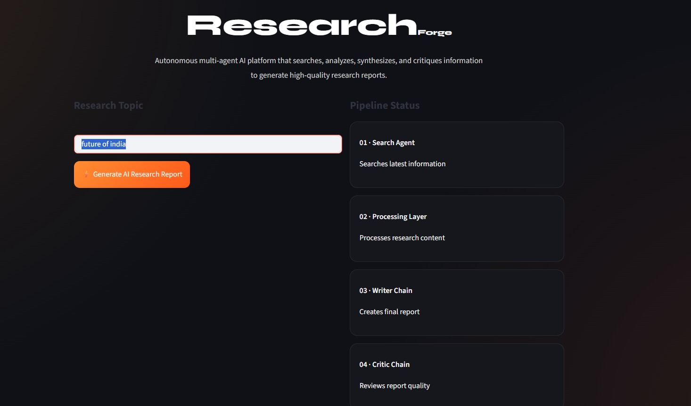
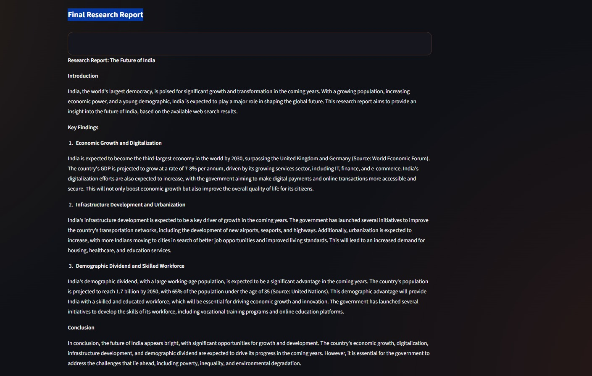

# ResearchForge AI

ResearchForge AI is a Multi-Agent Generative AI Research System designed to autonomously search, process, synthesize, and critique information to generate structured research reports in real time.

The project demonstrates practical implementation of agentic AI workflows using LangChain, LLM orchestration, tool integration, and retrieval-based research pipelines.

---

## Key Highlights

- Built a multi-agent AI pipeline using LangChain
- Implemented autonomous AI agents for:
  - Web Search
  - Research Processing
  - Report Generation
  - Critique & Evaluation
- Integrated Groq LLMs for high-speed inference
- Connected Tavily Search API for real-time web research
- Designed modular AI workflow architecture
- Built interactive frontend using Streamlit
- Optimized token usage and inference latency for efficient execution

---

## Tech Stack

### Generative AI & LLMs
- LangChain
- Groq LLM API
- Prompt Engineering

### AI Workflow Architecture
- Multi-Agent Systems
- Agentic AI Pipelines
- LLM Orchestration
- AI Output Evaluation

### Backend
- Python

### Frontend
- Streamlit

### APIs & Tools
- Tavily Search API

---

## System Workflow

1. Search Agent retrieves relevant real-time information from the web
2. Processing Layer structures and filters research content
3. Writer Chain generates comprehensive AI research reports
4. Critic Chain evaluates report quality and coherence

---

## Installation

```bash
pip install -r requirements.txt
```

---

## Run Locally

```bash
streamlit run app.py
```

---

## Project Structure

```bash
├── app.py
├── agents.py
├── tools.py
├── pipeline.py
├── requirements.txt
```

---
## Screenshots

### Landing Page



### AI Generated Research Report



## Author

Ayush Tiwari
